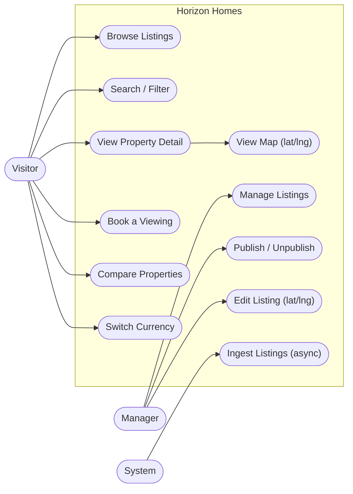
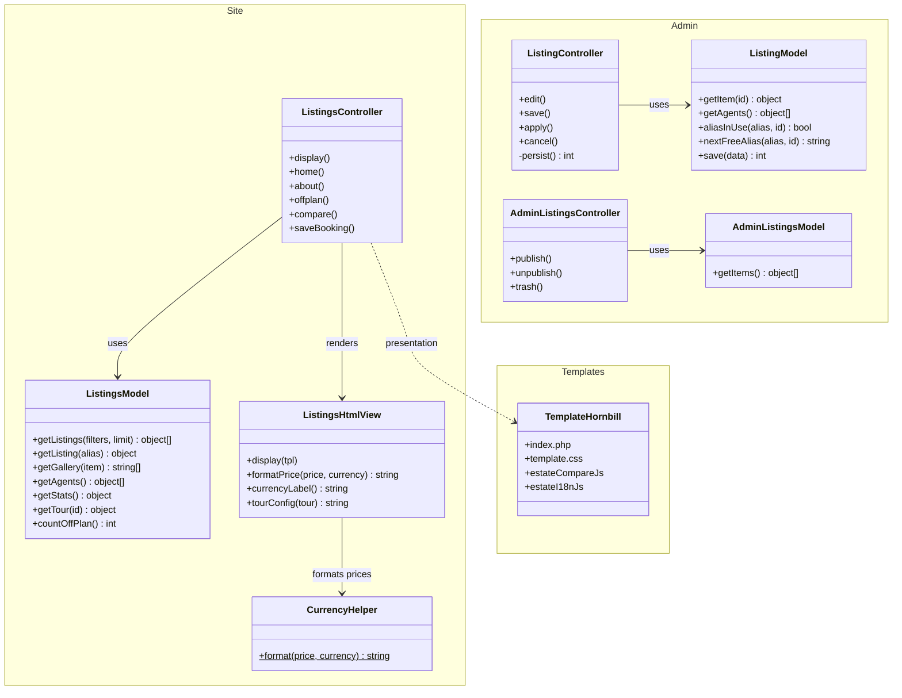
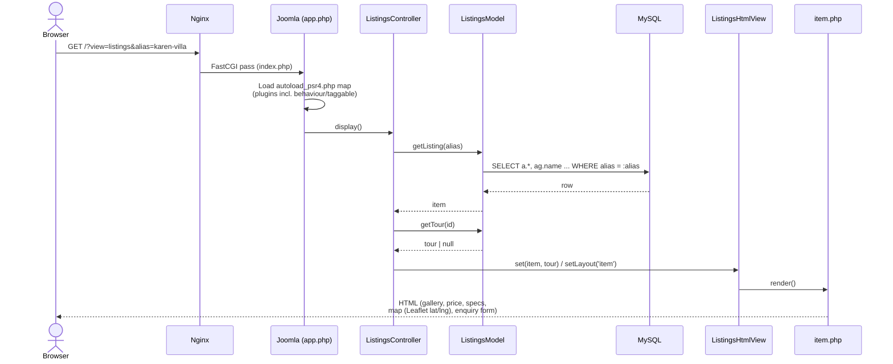
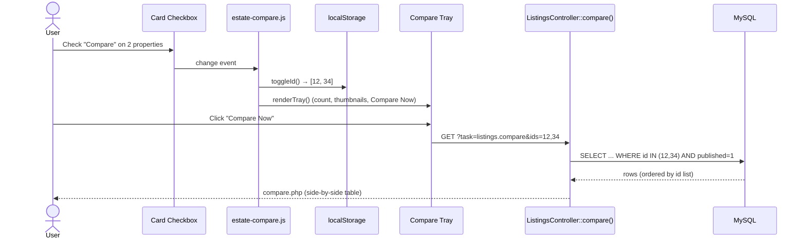
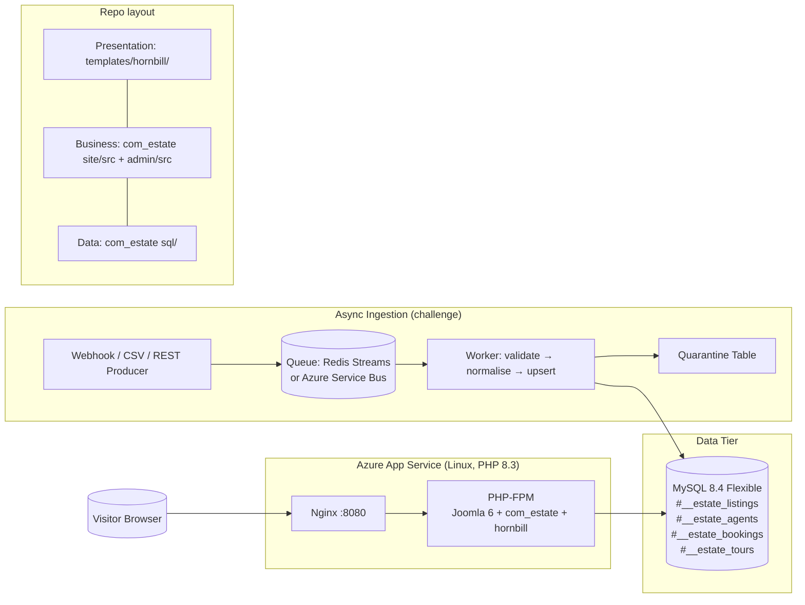
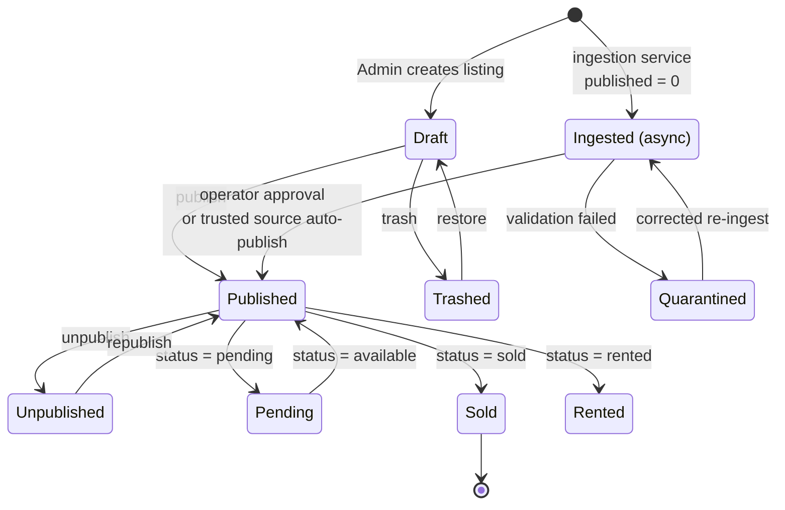

# Horizon Homes Real Estate — Joomla 3-Tier Website

[](https://github.com/ogc16/horizon-homes-joomla/actions/workflows/ci.yml)
[](https://github.com/ogc16/horizon-homes-joomla/actions/workflows/codeql.yml)
[](https://github.com/ogc16/horizon-homes-joomla/actions/workflows/security.yml)
[](LICENSE)
[](https://www.joomla.org/)
[](https://php.net/)

A real estate company website built on the **Joomla CMS** and structured around a
strict **3-tier architecture** (Presentation / Business Logic / Data).

> 📄 See [`problem.md`](problem.md) for the asynchronous listing-ingestion
> challenge this project is evolving toward.

## 🌐 The Three Tiers

This project keeps the three logical layers clearly separated, as Joomla expects:

| Tier | What it does | Where it lives |
|------|--------------|----------------|
| **1. Presentation** | Rendering & output formatting only. No business rules. | `templates/hornbill/` (site template) + `components/com_estate/site/tmpl/` (HTML tmpl files) |
| **2. Business Logic** | Models & controllers that hold rules (filtering, validation, security, access control). | `components/com_estate/site/src/` + `components/com_estate/admin/src/` |
| **3. Data** | Database schema, relationships and seed data. | `components/com_estate/sql/*.sql` + `admin/sql/` (MySQL) |

### Data flow
```
[Presentation Tier]  ──renders──►  [Business Logic Tier]  ──queries──►  [Data Tier]
   template + views                    models/controllers                 MySQL tables
        ▲                                    │                                 │
        └──────────── user actions ◄─────────┴──────────── results ◄──────────┘
```

## 📐 UML Diagrams

### Use Case Diagram



### Class Diagram (com_estate component)



### Sequence Diagram (listing detail page request)



### Sequence Diagram (compare feature — client + server)



### Component / Deployment Diagram



### State Diagram (listing lifecycle)



## 🏗 What's included

- **`com_estate` component** (business + data tiers)
  - `#__estate_listings` — the properties (houses, apartments, land, commercial)
  - `#__estate_agents` — the agents who list & manage properties
  - `#__estate_bookings` — visitor "book a viewing" enquiries submitted via a form
  - Public gallery view with live search/filter (city, type, sale/rent)
  - Single-listing detail page with agent card + viewing-enquiry form
  - About page
  - Joomla admin backend to list/publish/unpublish/delete listings
- **`hornbill` template** (presentation tier)
  - Responsive, modern real-estate layout (search bar, property cards, detail & booking UI)

## 🐳 Run with Docker (recommended)

The whole stack — Joomla 6, the `com_estate` component and a MariaDB database
pre-loaded with the sample data — boots with one command. No local PHP,
Joomla or MySQL install required.

```bash
# Optional: override the default ports/credentials first
cp .env.example .env

docker compose up -d --build
```

Then open **http://localhost:8080** (admin at `/administrator`).

| Setting | Default |
|---------|---------|
| Site URL | http://localhost:8080 |
| Admin URL | http://localhost:8080/administrator |
| Admin user | `admin` |
| Admin password | `Admin1234!Horizon` |
| DB name / user / pass | `joomla` / `joomla` / `joomlapass` |

### How it works

- **`Dockerfile`** — based on the official `joomla:6.1-php8.3-apache` image.
  Custom files are staged under `/usr/src/custom` because the base image
  mounts `/var/www/html` as a volume.
- **`docker/entrypoint.sh`** — copies the Joomla core, syncs the component,
  template and assets into the webroot, removes the web installer, generates
  `configuration.php` from env vars, waits for the database and starts Apache.
- **`docker/mysql/initdb/01-joomla.sql`** — the database dump restored on the
  first boot (menus, template assignment and `#__estate_*` seed data included).
- **`docker-compose.yml`** — MariaDB 10.11 + the app, with health checks.

### Useful commands

```bash
docker compose logs -f joomla     # follow the app logs
docker compose down               # stop (keeps the database volume)
docker compose down -v            # stop and wipe the database
docker compose up -d --build      # rebuild after changing source files
```

> Need to reset to a clean database? `docker compose down -v && docker compose up -d`.

## ✅ Quality & continuous integration

Every push and pull request runs a full quality gate through GitHub Actions:

| Workflow | What it enforces |
|----------|------------------|
| `ci.yml` | PHP 8.3/8.4 syntax matrix, PHPCS (PSR-12), ShellCheck, Hadolint, EditorConfig, Yamllint, plus a Docker build with PHPStan (level 6) and an end-to-end smoke test |
| `codeql.yml` | CodeQL static analysis (JavaScript/TypeScript) |
| `security.yml` | Gitleaks secret scan, Trivy filesystem scan, container SBOM, OpenSSF Scorecard |
| `docker-publish.yml` | Multi-arch image (amd64/arm64) with provenance and SBOM, signed with Cosign (keyless); publishes a GitHub Release on `v*` tags |
| `deploy.yml` | Manual, environment-gated deployment to Azure App Service |

The same checks run locally through the `Makefile`:

```bash
make lint             # PHPCS, ShellCheck, Hadolint, EditorConfig, Yamllint
make lint-php         # PHPCS (PSR-12) only
make php-lint         # php -l over every component file
make phpstan          # static analysis inside the running container
make smoke            # route + content smoke test against the running stack
```

Linting and formatting rules live in `.editorconfig`, `phpcs.xml.dist`,
`.editorconfig-checker.json`, `.shellcheckrc`, `.hadolint.yaml` and
`.yamllint.yaml`. Install the git hooks with
`pip install pre-commit && pre-commit install`.

## 🚀 Install on XAMPP

### 1. Requirements
- [XAMPP](https://www.apachefriends.org/) (Apache + PHP 8.3+ + MySQL/MariaDB)
- Joomla 6.x

### 2. Get Joomla running first
1. Install XAMPP, start **Apache** and **MySQL** from the XAMPP Control Panel.
2. Download the [Joomla 6 package](https://downloads.joomla.org) and extract it to
   `C:\xampp\htdocs\joomla` (or copy this project folder there).
3. Browse to `http://localhost/joomla` and complete the Joomla installer
   (create a database, e.g. `joomla`, and use the `utf8mb4` collation).

### 3. Copy this project into htdocs
Place/replace the files from this folder into your Joomla install:

| This project folder | Destination |
|---------------------|-------------|
| `templates/hornbill` | `C:\xampp\htdocs\joomla\templates\hornbill` |
| `components/com_estate` | `C:\xampp\htdocs\joomla\components\com_estate` |

### 4. Install the component (creates the database tables)
1. Zip the **contents** of `components/com_estate` (the `estate.xml` manifest must
   sit at the zip root, alongside `site/`, `admin/` and `sql/`).
2. Log into the Joomla admin: `http://localhost/joomla/administrator`
3. **System → Install → Extensions → Upload Package File** and upload the zip.
   Joomla runs `sql/install.mysql.utf8.sql`, creating the three tables and
   seeding sample agents + listings.

> Alternative command line (XAMPP):
> `php C:\xampp\htdocs\joomla\cli\joomla.php extension:install --path=com_estate.zip`
>
> Alternative manual import: import `sql/install.mysql.utf8.sql` with phpMyAdmin,
> replacing `#__` with your Joomla table prefix (e.g. `jml_`).

### 5. Apply the site template
1. Admin → System → Site Templates → set **hornbill** as the default.
2. Publish menu items in **Menus → Main Menu** pointing to the component
   (listings view, and `task=listings.about` for the About page).

### 6. Add property photos
Drop listing images into `images/properties/` (e.g. `karen-villa.jpg`) and update
the `main_image` column, or upload via the Joomla Media Manager and reference the
returned path.

## 🔑 Default users / roles (3-tier style access)
- **Public visitor** — browse/listings, search, submit a viewing enquiry.
- **Registered user** — same as public (extendable: save favourites).
- **Super User / Estate Manager** — backend to manage listings & agents.

## 📁 Folder map (component)
```
components/com_estate/
├── estate.xml                    # Install manifest (runs SQL, registers menu)
├── sql/                          # ★ DATA TIER schema + seed
│   ├── install.mysql.utf8.sql
│   └── uninstall.mysql.utf8.sql
├── site/                         # Site (Presentation + Business Logic)
│   ├── services/provider.php     # DI bootstrap
│   └── src/
│       ├── Controller/           # display + saveBooking (validation rules)
│       ├── Model/ListingsModel.php
│       └── View/Listings/HtmlView.php
│   └── tmpl/listings/            # default.php, item.php, about.php (markup)
└── admin/                        # Backend
    ├── services/provider.php     # DI bootstrap
    ├── src/Controller/ListingsController.php   # publish/unpublish/trash
    ├── src/Model/ListingsModel.php
    ├── src/View/Listings/HtmlView.php
    ├── tmpl/listings/default.php
    ├── forms/filter_listings.xml # searchtools filter form
    ├── config.xml, access.xml, estate.xml
    └── language/en-GB/...
```

## 🧭 Useful URLs (after install on XAMPP)
- Site listings: `http://localhost/joomla/index.php?option=com_estate&view=listings`
- Single listing: `http://localhost/joomla/index.php/component/estate?view=listings&alias=modern-4-bedroom-villa-in-karen`
- About: `http://localhost/joomla/index.php?option=com_estate&task=listings.about`
- Compare: `http://localhost/joomla/index.php?option=com_estate&view=listings&task=listings.compare&ids=1,2,3`
- Admin: `http://localhost/joomla/administrator`

## 🧩 Key features
- **Search & filter** — city, type, sale/rent, off-plan toggle
- **Property detail** — gallery + lightbox, 360° Pannellum tour, agent card, enquiry form
- **Map** — Leaflet/OpenStreetMap embed pinned to `latitude` / `longitude`
- **Compare** — select up to 4 listings and view a side-by-side table
- **Multi-currency** — KSh / USh / TSh / RWF with geo-IP auto-detection
- **Admin CRUD** — full backend to create, edit, publish, and trash listings

## 🤝 Contributing

Contributions are welcome! Please read [CONTRIBUTING.md](CONTRIBUTING.md) for
branch naming, coding conventions, and the PR checklist. All participation is
governed by our [Code of Conduct](CODE_OF_CONDUCT.md).

## 📄 License

This project is licensed under the [MIT License](LICENSE) — free to use, modify,
and distribute, with attribution.

